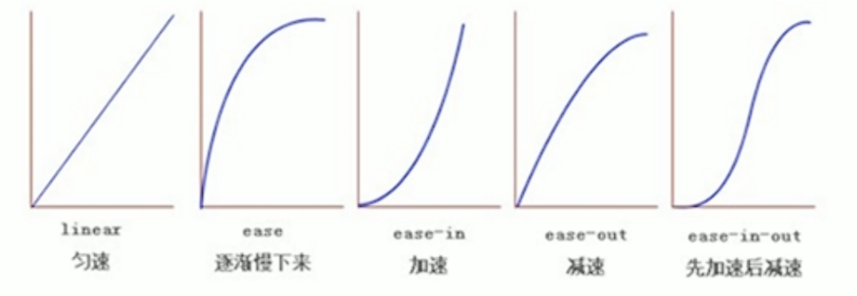

# CSS3新特性

## CSS3新增选择器

- 属性选择器(权重为10)

eg:

    1. input[value/type = "text"] {
        --------;
        --------;
    }

    2. ---[class^=icon] {
        --------;
        --------;
    }(具有class属性且值以icon开头)

    3. ---[class&=icon] {
        --------;
        --------;
    }(具有class属性且值以icon结尾)

    4. ---[class*=icon] {
        --------;
        --------;
    }(具有class属性且值中有icon)

- 结构伪类选择器

1. E: first-child: 匹配父元素中的第一个子元素E
2. E: last-child: 匹配父元素中最后一个子元素E
3. E: nth-child(n/even/odd/3n): 匹配父元素中的第n/even/odd/3n个子元素E
4. E: first-of-type: 指定类型E的第一个
5. E: last-of-type: 指定类型E的最后一个
6. E: nth-of-type(n): 指定类型E的第n个

区别

1. nth-child对父元素里所有孩子排序选择, 先找到第n个孩子, 再和E匹配
2. nth-of-type对父元素里指定子元素进行排序, 先匹配E, 再根据E找到第n个孩子

- 伪元素选择器(权重为1)

利用css创建html标签, 从而简化html结构

1. ::before

2. ::after

注意:

1. 必须有content属性
2. 创建后为行盒
3. 新创建的元素在文档树中找不到

## CSS3图片模糊处理

使用filter属性

filter: 函数();

eg: filter: blur(5px);  blur模糊处理, 数值越大越模糊

## CSS3 clac函数

clac()此CSS函数让你在声明CSS属性值时执行一些计算(+ - * /)

eg: 

    width: clac(100% - 30px);

表示子盒子永远比父盒子小30px

## CSS3过渡(动画)

语法: transition: 要过渡的属性 花费时间(单位是s, 必写) 运动曲线(默认是ease, 可以省略) 何时开始(默认是0s, 必写单位, 可以省略);

eg:

    div {
        width: 200px;
        height: 100px;
        background-color: red;
        transition: width .5s ease 0s, height .5s ease 0s; 或transition: all .5s ease 0s;
    }   

    div:hover {
        width: 400px;
        height 200px;
    }

