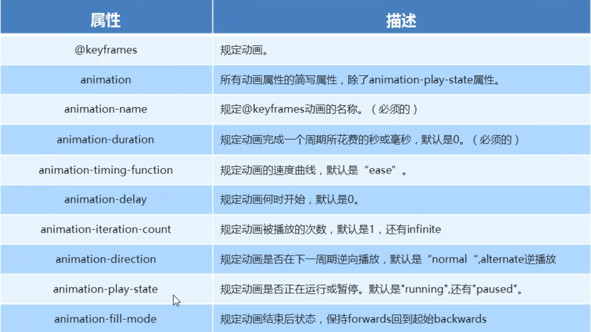

# CSS新特性2

## 2d转换

使用transform属性, 可以实现元素的位移, 旋转, 缩放等效果, **不会使盒子脱离常规流, 只是视觉上的改变**

- 移动: translate(X, Y)

    1. 不会影响其他盒子的位置
    2. 对行盒没有效果
    3. 百分比按盒子的高和宽 
    4. 盒子水平垂直居中的新方法:

            position: absolute;
            top: 50%;
            left: 50%;
            width: 200px;
            height: 200px;
            transform: translate(-50%, -50%);

- 旋转: rotate(度数deg)---正值为顺时针/负值为逆时针

    transform-origin: x y; --- 设置转换中心点(默认是50% 50%, 也可以写方位名词, 如center center)

- 缩放: scale(x, y) --- x和y表示倍数/小数表示缩小, 没有单位

    注意: 放大/缩小时四个边都会变化, 且不会影响其他盒子, 也可设置缩放中心点.

注意: 
    
1. 简写按照以上顺序来写
2. 顺序改变会影响其效果(先旋转会改变坐标轴方向)
3. 位移在一般情况下写到最前面

## 动画

### 步骤

1. 先定义动画

2. 再使用/调用动画

### 定义动画
eg:

    @keyframes 动画名称 {
        0%{
            width: 100px;
        }
        100%{
            width: 200px;
        }
    }

### 调用动画

一般来说, 调用动画时, 父盒子最好不要脱离常规流

eg:

    div {
        ------;
        ------;
        animation-name: 动画名称;
        animation-duration: 持续时间;
    }

### 动画序列

1. 0%是动画开始, 100%是动画的完成
2. 在@keyframes中规定某项CSS样式, 就能创建由当前样式逐渐改为新样式的动画效果
3. 可以改变任意多的样式任意多的次数
4. 关键词"from" 和 "to" 等同于0%和100%

### 动画属性

简写属性按照上述顺序

速度曲线的细节:

值: steps(number) --- 指分步长来进行动画

## 3d转换

**在进行3d转换时, 要让子盒子脱离常规流, 使用绝对定位**

eg:

    .box1 {
        position: relative; /* 创建定位上下文 */
        height: 200px;      /* 明确容器尺寸 */
    }

    .front, .bottom {
        position: absolute;
        top: 0;
        left: 0;
        width: 100%;    //预设
        height: 100%;   //预设
        backface-visibility: hidden; /* 重要！ */
    }

- 3d位移: translate3d(x, y, z)
- 3d旋转: rotate3d(x, y, z, deg) 自定义坐标轴旋转(矢量)

    1. rotateX(deg) 绕X轴旋转, 正值为正方向(用左手法则判断正方向, 大拇指指向坐标轴正方向, 则四指弯曲方向指向旋转正方向)
    2. rotateY(deg) 绕Y轴旋转
    3. rotateZ(deg) 绕Z轴旋转

- 透视: perspective

    1. 透视也称为视距, 视距就是人的眼睛距离屏幕的距离
    2. 透视的单位是像素 
    3. 透视一般写在被观察盒子的父盒子上, 也可以写在祖先盒子上
    4. 增加立体感的必要属性

- 3d呈现: transform-style

    1. 控制子元素是否开启三维立体空间
    2. 默认是关闭, 其值为flat
    3. preserve-3d值为开启
    4. 代码写给父级元素, 但影响的是子盒子

## 背景线性渐变

background: linear-gradient(起始方向(to right--从左到右), color, color)